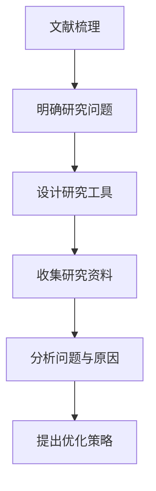

# 开题报告专项生成

## 一、选题判断

题目：

研究对象：

研究范围：

可行性判断：

## 二、选题依据

### 1. 现实背景

### 2. 政策背景

### 3. 学术背景

### 4. 问题提出

## 三、研究意义

### 1. 理论意义

### 2. 实践意义

## 四、国内外研究现状框架

### 1. 关于……的研究

### 2. 关于……的研究

### 3. 关于……的研究

### 4. 已有研究述评

## 五、研究目标与研究问题

### 1. 研究目标

### 2. 研究问题

1. 
2. 
3. 

## 六、研究内容

1. 
2. 
3. 

## 七、研究思路与研究方法

### 1. 研究思路

### 2. 研究方法

| 方法 | 使用目的 | 数据来源 | 操作方式 |
|---|---|---|---|

### 3. 技术路线

## 八、创新点

## 九、可行性分析

### 1. 资料可得性

### 2. 研究对象可接触性

### 3. 方法可操作性

### 4. 时间安排可完成性

## 十、研究进度安排

| 阶段 | 时间 | 主要任务 |
|---|---|---|
| 第一阶段 |  |  |
| 第二阶段 |  |  |
| 第三阶段 |  |  |
| 第四阶段 |  |  |
| 第五阶段 |  |  |

## 十一、需要继续补充的材料
