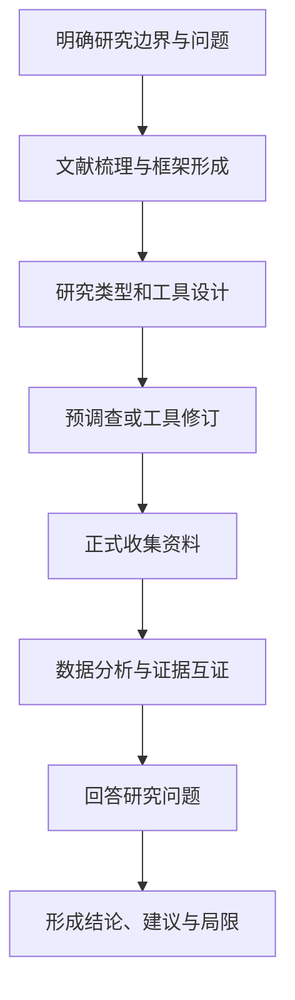

# 本科教育毕业论文开题报告核心内容

## 一、开题材料状态

题目：

现有材料：文献卡 / 文献综述 / 研究场域信息 / 理论依据 / 初步工具 / 其他。

尚缺材料：

本次可以完成：

本次不能写成确定事实的内容：

## 二、选题诊断

| 维度 | 判断 | 依据 | 调整建议 |
|---|---|---|---|
| 研究对象是否明确 |  |  |  |
| 核心问题是否清楚 |  |  |  |
| 概念是否可界定 |  |  |  |
| 范围是否可控 |  |  |  |
| 数据是否可获得 |  |  |  |
| 是否适合本科研究 |  |  |  |

推荐题目：

## 三、研究类型

建议类型：调查研究 / 案例研究 / 文本分析 / 实践探索 / 行动研究 / 理论政策分析 / 混合研究。

理由：

与研究条件的对应：

不采用其他类型的理由：

## 四、选题依据

### 1. 现实背景

从具体教育问题和研究场景切入，不用宏大背景替代问题。

### 2. 政策或课程标准依据

只使用能够直接支撑研究问题的政策与课标内容；没有准确来源时使用待核验标记。

### 3. 学术背景

说明已有研究讨论了什么、形成了什么基础、还存在哪个具体问题。

### 4. 问题提出

```text
现实问题
→ 已有研究基础
→ 尚未充分解决的问题
→ 本研究切入
```

## 五、研究意义

### 理论或认识价值

说明本研究能补充哪一对象、场景、过程或分析维度，避免夸大“填补空白”。

### 实践价值

明确对谁有何具体用途，在什么条件下成立。

## 六、文献综述结构

| 综述板块 | 核心问题 | 代表材料 | 已有贡献 | 主要不足 | 与本研究关系 |
|---|---|---|---|---|---|

研究述评应形成：研究基础—不足—切入点，不能只罗列观点。

## 七、核心概念与分析维度

| 概念 | 本研究界定 | 包括 | 不包括 | 依据 | 如何操作化 |
|---|---|---|---|---|---|

分析维度的来源：理论推导 / 文献归纳 / 政策或标准 / 预调查修订。

不得先设计问卷维度，再倒推概念和理论依据。

## 八、研究目标与研究问题

研究目标：

| 编号 | 研究问题 | 需要的证据 | 是否可回答 | 对应章节 |
|---|---|---|---|---|
| RQ1 |  |  |  |  |
| RQ2 |  |  |  |  |
| RQ3 |  |  |  |  |

研究目标不是研究内容的重复表述。

## 九、理论或分析框架

| 理论/框架 | 作用 | 对应研究问题 | 转化的维度 | 论文中的使用位置 |
|---|---|---|---|---|

理论无法进入维度、工具或结果解释时，不作为核心理论基础。

## 十、研究内容

| 研究内容 | 对应研究问题 | 主要材料 | 预期产物 |
|---|---|---|---|

研究内容应是实际分析任务，不写“查阅文献、撰写论文”等工作步骤。

## 十一、研究方法与工具

### 问题—方法—数据对齐

| 研究问题 | 研究对象/样本 | 数据来源 | 方法/工具 | 分析方式 | 风险 |
|---|---|---|---|---|---|

### 工具设计摘要

- 问卷维度及来源：
- 访谈主题及对象：
- 课堂观察维度：
- 文本样本和编码维度：
- 资料互证方式：

没有实际需要时，不堆叠问卷、访谈、观察和案例研究。

## 十二、研究过程与技术路线



根据实际研究删减，不虚构预调查、实践或多轮行动。

## 十三、创新与特色

从以下方面谨慎判断：

- 具体对象；
- 具体场景；
- 具体教学环节；
- 材料或数据；
- 分析维度；
- 实践工具。

不用“首次”“填补空白”“重大创新”。

## 十四、可行性

| 条件 | 当前基础 | 风险 | 调整方案 |
|---|---|---|---|
| 文献与理论 |  |  |  |
| 研究对象可接触性 |  |  |  |
| 时间 |  |  |  |
| 工具 |  |  |  |
| 数据分析能力 |  |  |  |
| 伦理与隐私 |  |  |  |

## 十五、进度安排

| 阶段 | 时间 | 核心任务 | 可验证产物 |
|---|---|---|---|
| 选题与综述 |  |  |  |
| 工具设计与修订 |  |  |  |
| 数据收集 |  |  |  |
| 数据分析 |  |  |  |
| 写作与修改 |  |  |  |

## 十六、研究对齐总表

| 研究问题 | 理论/维度 | 数据 | 方法 | 分析 | 章节 | 结论边界 |
|---|---|---|---|---|---|---|

## 十七、开题质量门槛

- [ ] 题目、概念和问题相互对应；
- [ ] 研究类型与目录、方法一致；
- [ ] 每个研究问题都有可获得的数据；
- [ ] 每种方法都有明确用途；
- [ ] 维度有理论或文献来源；
- [ ] 结论不在研究前被预设；
- [ ] 创新点没有夸大；
- [ ] 研究可在本科时间和场域内完成。

## 十八、待补材料

只列影响研究成立的关键材料，并说明缺失会影响哪一部分。
