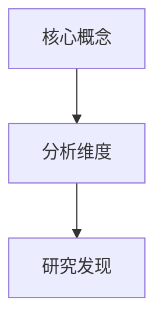

# 理论基础与分析框架解析

## 一、显性理论识别

| 理论/框架 | 原文出现位置 | 作者使用方式 | 判断 |
|---|---|---|---|

## 二、隐含理论或分析逻辑

## 三、理论作用分析

| 理论/框架 | 作用环节 | 具体作用 | 是否贯穿全文 |
|---|---|---|---|

## 四、理论适配性评价

适配程度：

理由：

1. 
2. 
3. 

## 五、理论关系图

## 六、对我的论文理论框架启示

可借鉴理论：

适合原因：

使用方式：

- 作为理论基础：
- 作为分析维度：
- 作为变量关系：
- 作为讨论解释：

注意事项：
